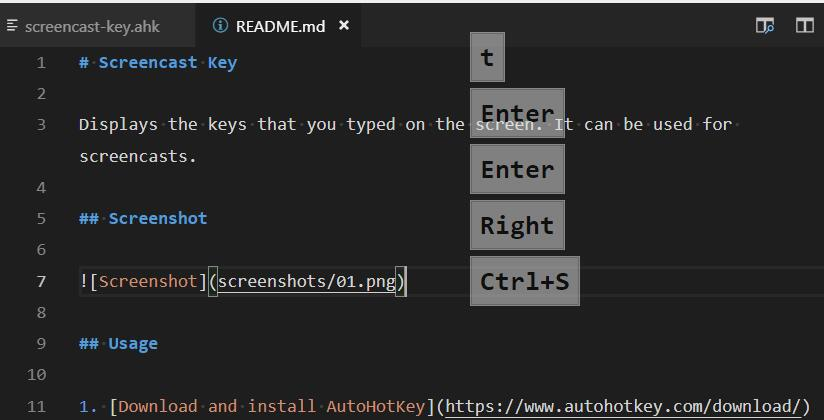

# Screencast Key

Displays the keys that you typed on the screen. It is useful for screencasts.

## Screenshot

## Usage

1. [Download and install AutoHotKey](https://www.autohotkey.com/download/)
2. [Download and unzip this script](https://github.com/ganlvtech/screencast-key/archive/master.zip)
3. Double Click the `screencast-key.ahk`
4. Exit the script right click the AutoHotKey icon in the tray.
5. You can edit the settings in the script

## Related Links

* Inspired by <https://github.com/mihaifm/screenkey.ahk>
* <https://www.autohotkey.com/>
* <https://autohotkey.com/board/topic/62546-solved-autosizing-controls-at-runtime/?p=394486>
* <https://autohotkey.com/board/topic/43968-guicontrol-move-mycontrol-wa-auto/?p=273409>
* <https://autohotkey.com/board/topic/61388-transparent-gui/?p=387103>

## LICENSE

    The MIT License (MIT)

    Copyright (c) 2018 Ganlv

    Permission is hereby granted, free of charge, to any person obtaining a copy
    of this software and associated documentation files (the "Software"), to deal
    in the Software without restriction, including without limitation the rights
    to use, copy, modify, merge, publish, distribute, sublicense, and/or sell
    copies of the Software, and to permit persons to whom the Software is
    furnished to do so, subject to the following conditions:

    The above copyright notice and this permission notice shall be included in
    all copies or substantial portions of the Software.